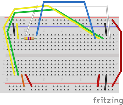
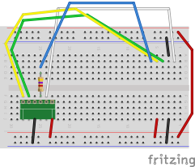

# ROMs

This document is about ROM chips.

There are several very common ROM chip types, and several less common.

* SPI NOR Flash
* SPI NAND Flash
* eMMC

## SPI NOR Flash

Part numbers are frequently in the `25` series.

The package is typically and SOP/SOIC-8.

Voltage range is typically 2.6V to 3.6V.
Chip frequencies are often >100 MHz,
although my programmer isn't nearly that fast.

### Chip Pinout

| Pin | SPI-Mode Name | SPI Mode Function         | Dual-SPI Mode | Quad-SPI Mode | Note                               |
|-----|---------------|---------------------------|---------------|---------------|------------------------------------|
| 1   | /CS           | Chip select, active low   | /CS           | /CS           |                                    |
| 2   | DO            | MISO                      | IO1           | IO1           | 10 mA max, recommend 4.7K resistor |
| 3   | /WP           | Write protect, active low | /WP           | IO2           |                                    |
| 4   | GND           | Ground                    | GND           | GND           |                                    |
| 5   | DI            | MOSI                      | IO0           | IO0           |                                    |
| 6   | CLK           | SPI clock                 | CLK           | CLK           |                                    |
| 7   | /HOLD         | Hold, active low          | /HOLD         | IO3           | Often also /RESET                  |
| 8   | VCC           | Positive supply           | VCC           | VCC           | 2.6V to 3.6V                       |

### Programming

#### Hardware

##### pico-serprog

pico-serprog is a programmer made from a Pico, which I have on hand,
and open-source firmware.

#### Software

##### flashrom

I prefer flashrom because it works on Mac and Linux,
and works nicely with pico-serprog.

### Wiring

#### For DIP-8 (SOIC/SOP-8 on a Carrier)

For eight-pin chips, which are usually surface-mount parts,
I first put them in/on a carrier, which gives them DIP-8 interfaces.
This is how I have my pico-serprog wired to read them:

[pico-serprog_dip-8.fz](pico-serprog/pico-serprog_dip-8.fz)

Note that `/HOLD (/RESET)` is hardwired high,
and `/WP` is hardwired low.

I've been able to write chips,
so apparently `/WP` is more of a suggestion than an actual protection.

#### For Noyito Carrier Board

I also have blank chips that come on Noyito brand carrier boards.
Here's how they're wired.

[pico-serprog_noyito.fz](pico-serprog/pico-serprog_noyito.fz)

### References

* [Adafruit SPI FLASH Breakouts](https://learn.adafruit.com/adafruit-spi-flash-breakouts/pinouts)
* [DigiKey: W25 SpiFlash Series](https://www.digikey.com/en/product-highlight/w/winbond/w25-spiflash-series)
* [Winbond SpiFlash Memories with SPI, Dual-SPI, Quad-SPI and QPI](https://www.winbond.com/productResource-files/DA05-0006.pdf)

## SPI NAND Flash

It's different from NOR flash.
Apparently I don't have any programmer for it.

* flashrom doesn't do it, something about ECC.
* [PicoFlasher](https://consolemods.org/wiki/Xbox_360:PicoFlasher) requires J-Runner, which is for Windows.
* SNANDer doesn't seem to support W25N series

## eMMC

Not the same as MMC.
Also don't have the means to do it.
